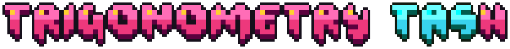

 

if you just want to play the game, download the [latest release](https://github.com/sogful/trigtash/releases/latest) and run `Trigonometry Dash.exe`! 
don't move the exe out by itself (and don't delete `/game/index.html`)

for the gdevelop project, see `/project/` 
for javascript injected into the project, see `/scripts/` 
`/dependencies/` is just stuff that's used for general tasks:
  - ffmpeg source code for bundling a stripped down version of it for video exports
  - adjusted tauri as an alternative to electron
  - gdexporter to package the game without having to do it 
so realistically you don't even have to open the gdevelop ide to edit this mod :p

to rebuild the game, run `build.bat`. 
for a smaller 40mb build without hq audio, run `build (small).bat`.
